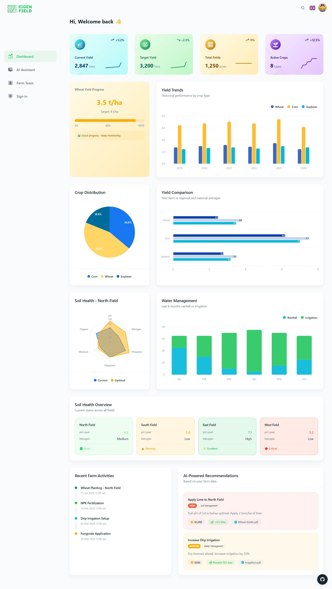
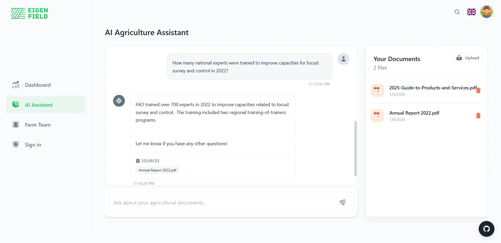

## RAG Agriculture Knowledge Assistant

A smart document retrieval system that converts agricultural documents into an interactive form for building an intelligence base. The retrieval-augmented generation system is used to ask the system any question the users wish to know with the answer being referenced and accurate.

---

## 📸 Media & Demos

<details>
  <summary><b>📊 View Analytics Dashboard</b></summary>
  <br/>
  <p align="center">
    
  </p>
</details>

<details>
  <summary><b>💬 View RAG Chat Interface</b></summary>
  <br/>
  <p align="center">
    
  </p>
</details>

<details>
  <summary><b>🎬 Watch System Demo</b></summary>

  https://github.com/user-attachments/assets/db6bcbdd-0435-4644-ae8b-35c532c09d5f

</details>
  
---

### Key Features

- **Document Upload/Indexing**: Automatically indexes PDF files, cleans text using PyMuPDF, and generates vector representations for semantic searching.
- **Natural Language Queries**: Ask questions in natural, everyday language and receive answers that take context into consideration.
- **Source Attribution**: Each answer contains references to the source documents, making them traceable and verifiable.
- **Vector Similarity Search**: Based on ChromaDB for efficient semantic document searches by meaning, not keyword.
- **Integration of LLM**: Using Ollama for local inference with **Qwen2:1.5B**, preserving privacy and avoiding API charges.
- **Document Management**: See, list, and delete indexed documents via a clean API.

### Technical Architecture

- **Backend**: FastAPI with async support.
- **Vector Database**: ChromaDB for persistent embedding storage.
- **Embeddings**: Default ChromaDB embedding function.
- **LLM**: Ollama (local inference) with **Qwen2:1.5B**.
- **Document Processing**: **PyMuPDF (fitz)** for text extraction, LangChain for recursive chunking.
- **Containerization**: Docker + Docker Compose managed via **Makefile**.

### System Performance

- **Fast Indexing**: Processes complex PDFs quickly using high-performance C-based extraction (fitz).
- **Sub-second Retrieval**: Retrieves relevant context chunks in <100ms via vector search.
- **Streaming Responses**: Real-time token generation for a smooth user experience.
- **Scalable Storage**: Persistent vector database ensures knowledge remains available across restarts.

### Installation & Setup

The project is fully containerized. Use the provided **Makefile** to manage the application:

```bash
# Build and start the entire stack (Ollama, Backend, Frontend)
make

# Stop all services
make down

# View live logs
make logs
```

### API Endpoints

POST   /upload                    # Upload and index PDF documents

GET    /documents                 # List all indexed documents  

DELETE /documents/{filename}      # Remove document from knowledge base

POST   /chat?query=...           # Ask questions and get answers

POST   /search?query=...         # Vector search without LLM generation

### Use Cases

- **Agricultural Research**: Query farming best practices, crop disease information, and irrigation guidelines
- **Knowledge Management**: Convert static document libraries into interactive Q&A systems
- **Decision Support**: Get quick answers from policy documents, regulations, and technical manuals
- **Educational Tools**: Create study assistants from textbooks and research papers

### Technical Highlights

- **Recursive Chunking**: Uses a 1500-character window to preserve semantic meaning better than fixed-size blocks.
- **Source-Grounded Responses**: LLM is constrained to answer only from provided context, preventing hallucinations
- **Containerized Orchestration**: Seamless deployment of AI, Backend, and Frontend services using Docker.
- **Local Data Privacy**: Entire pipeline runs locally; no data ever leaves your machine.

### Project Learnings

This project demonstrates expertise in:
- **Information Retrieval**: Vector embeddings, semantic search, and similarity metrics
- **NLP Engineering**: Text preprocessing, chunking strategies, and prompt engineering
- **System Design**: Building production-ready APIs with proper error handling and validation
- **AI/ML Integration**: Combining multiple AI components (embeddings, vector DBs, LLMs) into a cohesive system

### Future Enhancements

- Multi-modal support (images, tables from PDFs)
- Conversational memory for follow-up questions
- Batch document processing
- Advanced filtering (by date, document type, custom metadata)

---

This project showcases the practical application of RAG architecture for domain-specific knowledge extraction, demonstrating how modern AI can make large document collections instantly queryable.

